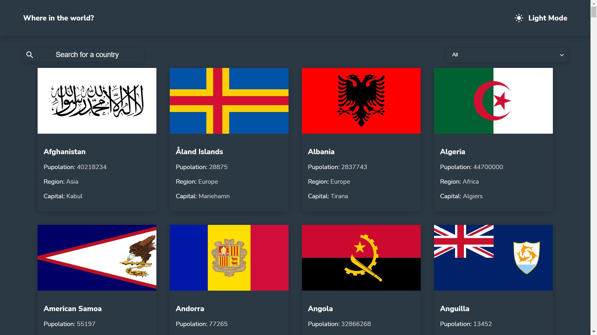

# Frontend Mentor - REST Countries API with color theme switcher solution

This is a solution to the [REST Countries API with color theme switcher challenge on Frontend Mentor](https://www.frontendmentor.io/challenges/rest-countries-api-with-color-theme-switcher-5cacc469fec04111f7b848ca). Frontend Mentor challenges help you improve your coding skills by building realistic projects.

## Table of contents

- [Overview](#overview)
  - [The challenge](#the-challenge)
  - [Screenshot](#screenshot)
  - [Links](#links)
- [My process](#my-process)
  - [Built with](#built-with)
  - [What I learned](#what-i-learned)
- [Author](#author)
- [Acknowledgments](#acknowledgments)

**Note: Delete this note and update the table of contents based on what sections you keep.**

## Overview

### The challenge

Users should be able to:

- See all countries from the API on the homepage
- Search for a country using an `input` field
- Filter countries by region
- Click on a country to see more detailed information on a separate page
- Click through to the border countries on the detail page
- Toggle the color scheme between light and dark mode _(optional)_

### Screenshot



### Links

- Solution URL: [https://github.com/iamzaidmohammed/countries-api](https://github.com/iamzaidmohammed/countries-api)
- Live Site URL: [http://countries-api-snowy-pi.vercel.app/](http://countries-api-snowy-pi.vercel.app/)

## My process

### Built with

- Semantic HTML5 markup
- CSS custom properties
- Flexbox
- CSS Grid
- Mobile-first workflow
- [React](https://reactjs.org/) - JS library

**Note: These are just examples. Delete this note and replace the list above with your own choices**

### What I learned

```html
<h1>Some HTML code I'm proud of</h1>
```

```css
.proud-of-this-css {
  color: papayawhip;
}
```

```js
const proudOfThisFunc = () => {
  console.log("🎉");
};
```

**Note: Delete this note and the content within this section and replace with your own learnings.**

## Author

- Website - [Zaid Mohammed](https://iamzaidmohammed.github.io)
- Frontend Mentor - [@zaidmohammed7](https://www.frontendmentor.io/profile/zaidmohammed7)
- Twitter - [@iamzaidmohammed](https://www.twitter.com/iamzaidmohammed)

**Note: Delete this note and add/remove/edit lines above based on what links you'd like to share.**

## Acknowledgments

- Github Profile[lukaasz555](https://github.com/lukaasz555)
- Frontend Mentor - [@lukaasz555](https://www.frontendmentor.io/profile/lukaasz555)

**Note: Delete this note and edit this section's content as necessary. If you completed this challenge by yourself, feel free to delete this section entirely.**
